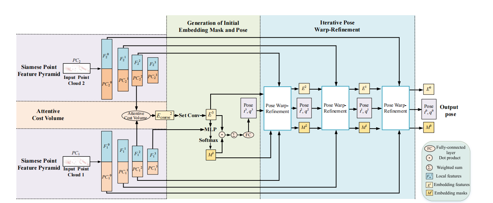
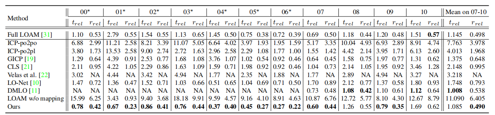

**PWCLO-Net: Deep LiDAR Odometry in 3D Point Clouds Using Hierarchical Embedding Mask Optimization (CVPR 2021)**
==============================================================================================================================
This is the official implementation of PWCLO-Net (CVPR2021), an end-to-end deep network for LiDAR odometry created by Guangming Wang, Xinrui Wu, Zhe Liu and Hesheng Wang.


## Citation
If you find our work useful in your research, please cite:

        @InProceedings{Wang_2021_CVPR,
            author    = {Wang, Guangming and Wu, Xinrui and Liu, Zhe and Wang, Hesheng},
            title     = {PWCLO-Net: Deep LiDAR Odometry in 3D Point Clouds Using Hierarchical Embedding Mask Optimization},
            booktitle = {Proceedings of the IEEE/CVF Conference on Computer Vision and Pattern Recognition (CVPR)},
            month     = {June},
            year      = {2021},
            pages     = {15910-15919}
        }


## Abstract

A novel 3D point cloud learning model for deep LiDAR odometry, named PWCLO-Net, using hierarchical embedding mask optimization is proposed in this paper. In this model, the Pyramid, Warping, and Cost volume (PWC) structure for the LiDAR odometry task is built to refine the estimated pose in a coarse-to-fine approach hierarchically. An attentive cost volume is built to associate two point clouds and obtain embedding motion patterns. Then, a novel trainable embedding mask is proposed to weigh the local motion patterns of all points to regress the overall pose and filter outlier points. The estimated current pose is used to warp the first point cloud to bridge the distance to the second point cloud, and then the cost volume of the residual motion is built. At the same time, the embedding mask is optimized hierarchically from coarse to fine to obtain more accurate filtering information for pose refinement. The trainable pose warp-refinement process is iteratively used to make the pose estimation more robust for outliers. The superior performance and effectiveness of our LiDAR odometry model are demonstrated on KITTI odometry dataset. Our method outperforms all recent learning-based methods and outperforms the geometry-based approach, LOAM with mapping optimization, on most sequences of KITTI odometry dataset. 


## Prequisites
    python 3.6.8
    CUDA 9.0
    TensorFlow 1.12.0  
    numpy 1.16.1  
    g++ 5.4.0 


## Usage

#### Compile Customized TF Operators
The TF operators are included under `tf_ops`, you need to compile them first by `make` under each ops subfolder (check `Makefile`). Update `arch` in the Makefiles for different <a href="https://en.wikipedia.org/wiki/CUDA#GPUs_supported">CUDA Compute Capability</a> that suits your GPU if necessary.

    cd ./tf_ops/sampling
    make
    cd ../grouping
    make
    cd ..

    

#### Datasets

We use [KITTI odometry dataset](http://www.cvlibs.net/datasets/kitti/eval_odometry.php) in our experiments. The ground truth of pose and relative transformation are stored in `ground_truth_pose` and `ground_truth_pose/kitti_T_diff`. 
The data of the KITTI odometry dataset should be organized as follows:

```
data_root
├── 00
│   ├── velodyne
│   ├── calib.txt
├── 01
├── ...
```

### Training
Train the network by running 
    
    sh command.sh  

Please reminder to specify the `mode`(train), `GPU`,`model`(path to PWCLONet model), `data_root`,`log_dir`, `train_list`(sequences for training), `val_list`(sequences for validation) in the scripts.


The training results and best model will be saved in `log_dir`.

### Testing

Please run 

    sh command.sh 
    

Train the network by running `sh command.sh` please reminder to specify the `mode`(test), `GPU`,`model`(path to PWCLONet model), `data_root`,`checkpoint_path`(path to pre-trained model for testing), `log_dir`, `test_list`(sequences for testing).


### Quantitative results:




### Acknowledgments

We thank all the CVPR reviewers and the following open-source project for the help of the implementations:
- [PointNet++](https://github.com/charlesq34/pointnet2) (Furthest Points Sampling and TF operators)
- [KITTI_odometry_evaluation_tool](https://github.com/LeoQLi/KITTI_odometry_evaluation_tool) 

